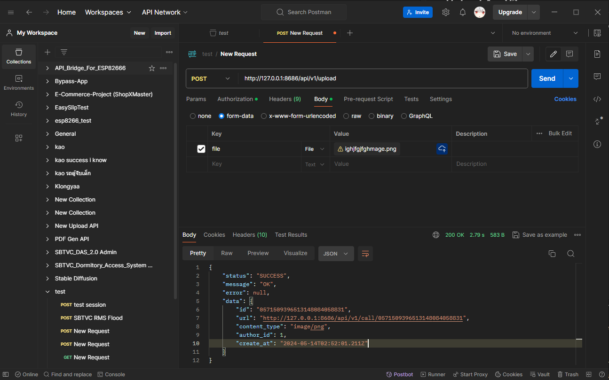

<h1>📤 Upload Api V2 ✌</h1>
<h4>This version of File upload api will use discord chat storage instead local storage and use prisma to manage sql query</h4>

<h1>✨ Preview ✨</h1>

<h1>💨 Install 💨</h1>

<strong>Note : โครงสร้าง Mysql connection : mysql://[username]:[password]@[host]:[port]/[database]</strong>

<strong>Note : สำหรับ Localhost(Xampp) : mysql://root@127.0.0.1:3306/[database]</strong>

<ol>
    <li>run <code>yarn install</code></li>
    <li>config ตั้งค่า env ทั้งหมด run <code>yarn prisma:migrate</code> สำหรับ Production รัน <code>yarn prisma:deploy</code></li>
    <li>เริ่ม Server รัน <code>yarn start</code> หรือ nodemon รัน <code>yarn dev</code></li>
</ol>

<h1>📝 Use 📝</h1>
<ol>
    <li>ใชั GET /api/v1/author/token/create?t=[token] เพื่อเเปลง Token จริงเป็น JWT Token</li>
    <li>ใช้ POST /api/v1/upload ส่งเป็น Form-data
        <ul>
            <li>Authorization : Bearer Token : ส่ง JWT Token ที่เเลกมาจากข้อ 1</li>
            <li>form-data key => file : [ไฟล์รูปภาพ]</li>
        </ul>
    </li>
    <li>ใช้ GET /api/v1/call/[id] เเทน ไอดีด้วย ID ของ File ที่อัปโหลด (จะได้รับ ID หลัง Upload สำเร็จ) เพื่อเป็นการเรียกไฟล์</li>
</ol>

<h1>💦 LOL 💦</h1>